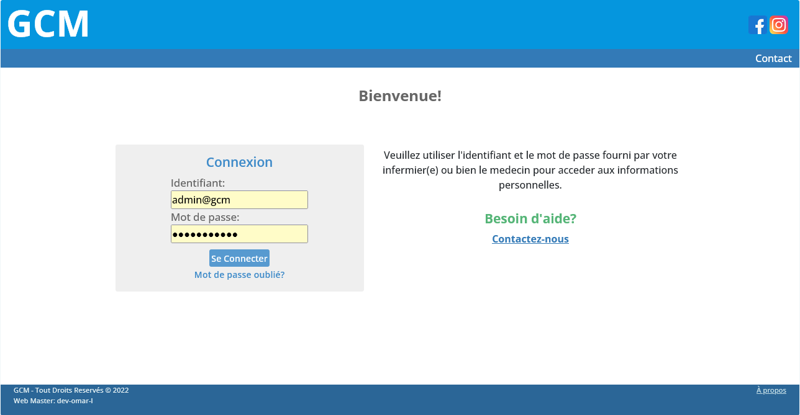
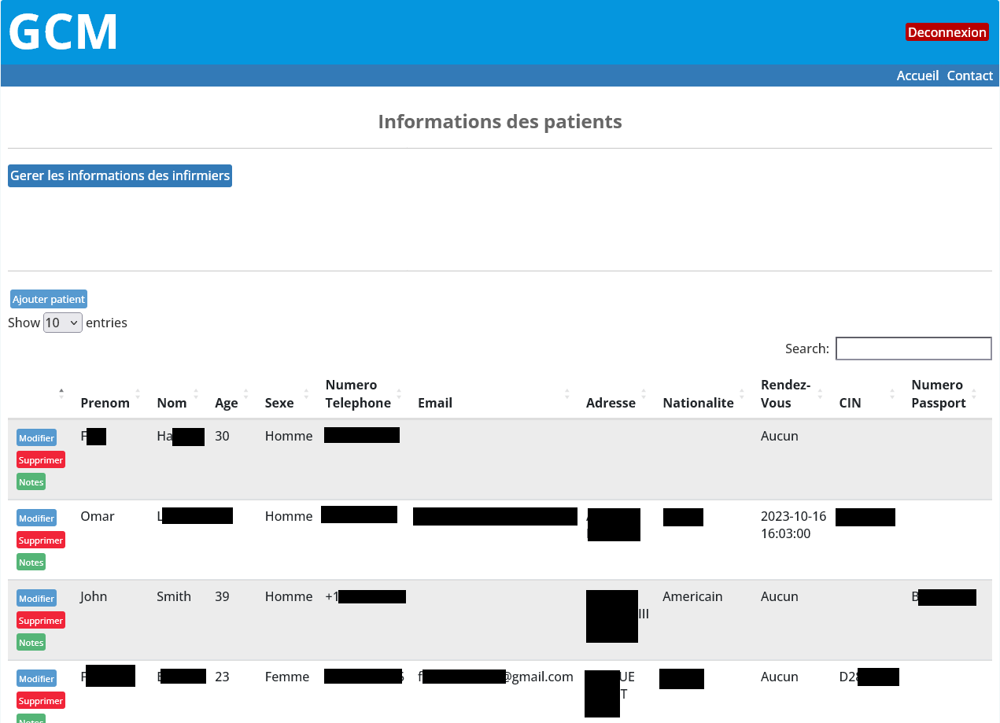
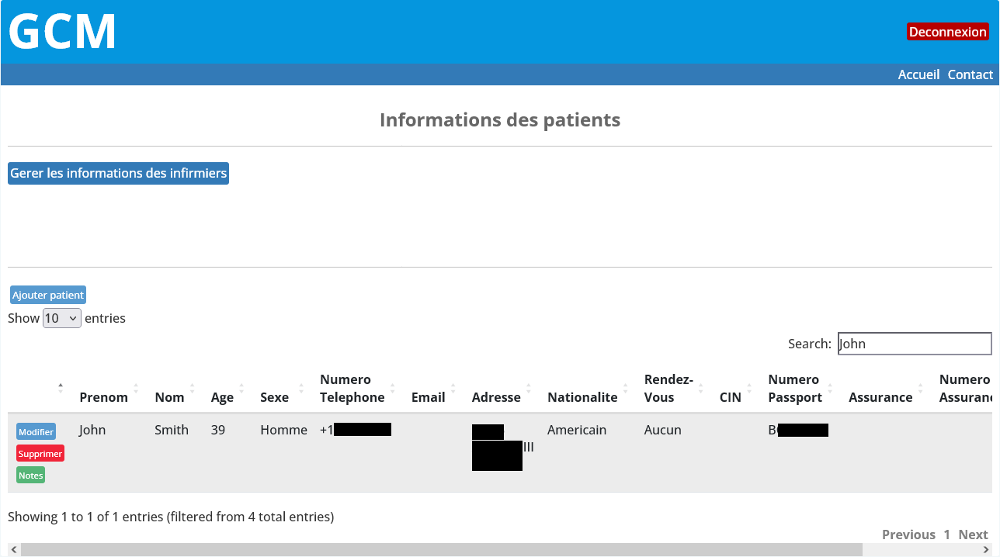
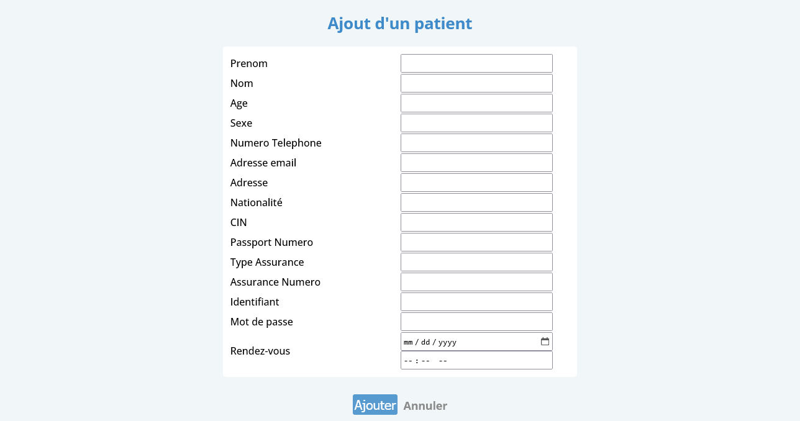
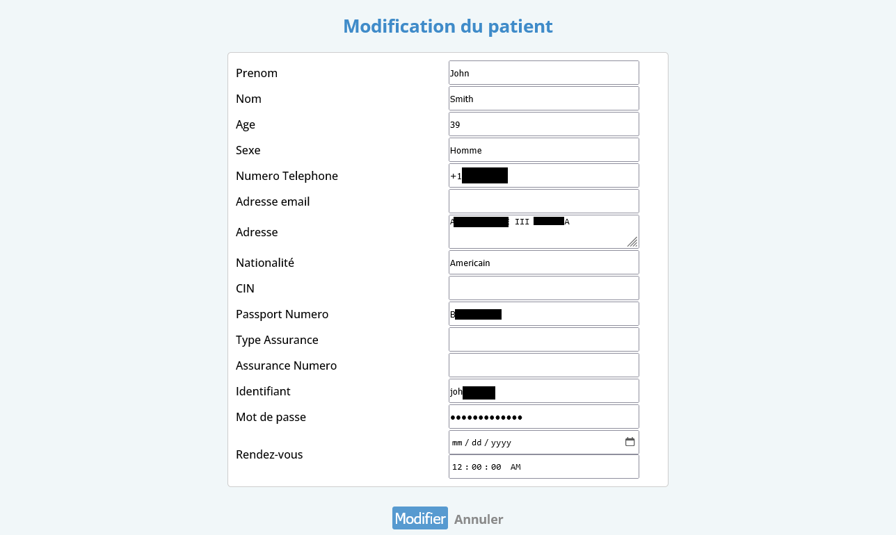
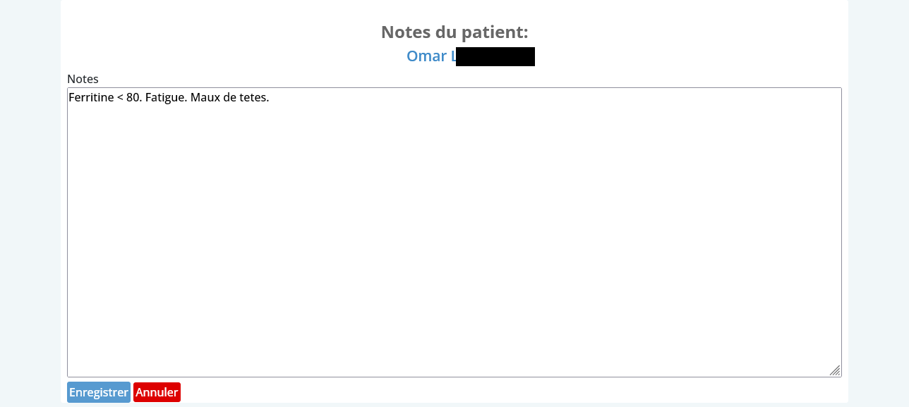
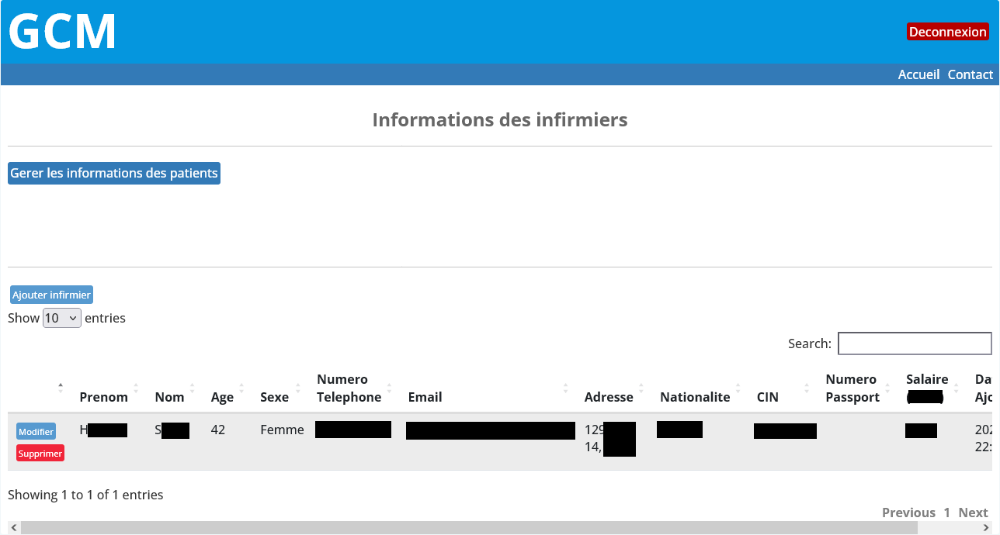
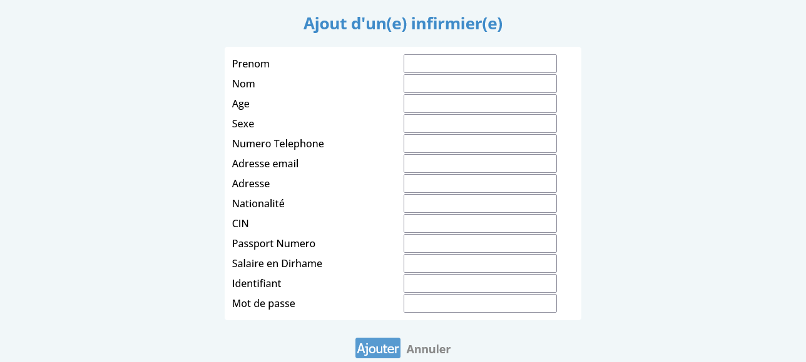
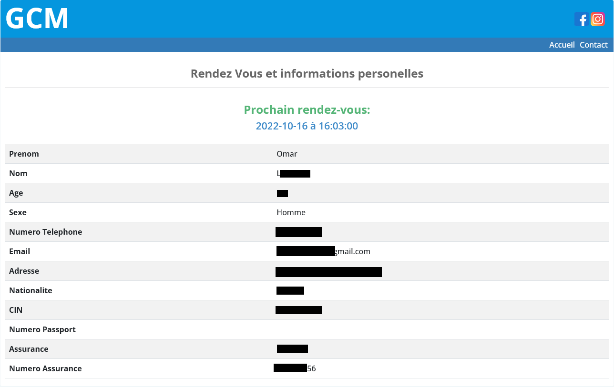

Academic Project: Web Application for the Management of a Clinical "GCM"

• Technologies:
HTML, CSS, PHP, JavaScript, MySQL, jQuery, Bootstrap, DataTables.

• Introduction:
Mobile-responsive clinical management web application with key features including: a secure login system; access management; employee and patient management; patients appointment tracking system; and more.

• Key Features:

Login Page. 3 types of users (doctor, staff/nurses, patients). Each type of user gets directed to their own homepage with specific privileges.

Patients information display

Searching for patients based on their data

Adding patients

Modifying patients data

Adding patients notes (visible only to the doctor)

Staff(nurses) data display

Adding staff

Patients appointment date checking

-17/06/2022
